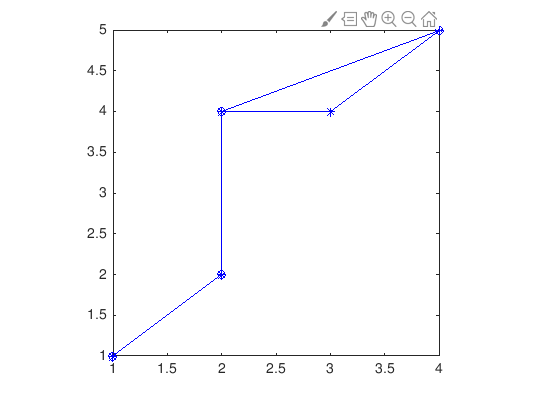
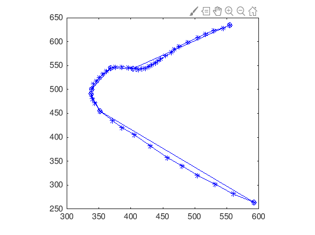

# approximate-trajectory-partitioning

This project implements the approximate trajectory partitioning algorithm on the paper *Trajectory Clustering: A Partition-and-Group Framework. Lee, Jae-Gil; Han, Jiawei; Whang, Kyu-Young*

## Usage

- Execute `trajactory_pratitioning.m`
- Choose dataset file

## Test case

sample_test.tra:

hurricane1950_2006.tra:

